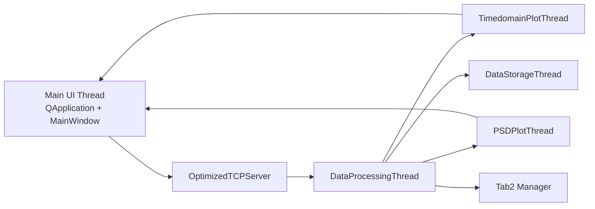
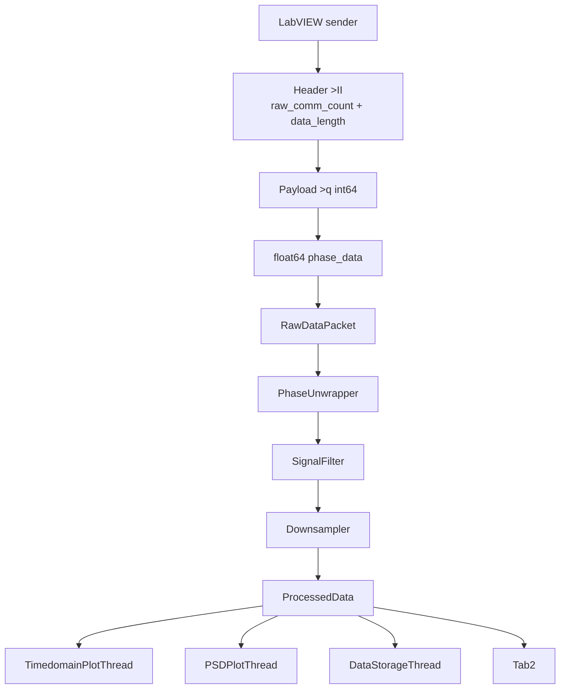

# 2026-03-12 Tab1 声发射数据通信与绘图开发文档

## 1. 文档目的

本文档描述当前 `Tab1 / FIP` 模块的最新实现状态。内容已根据当前代码结构更新，不再对应旧版分散式目录，而是对应重构后的 `src/fip_tab1` 架构。

## 2. Tab1 功能范围

Tab1 当前负责干涉仪声发射数据的实时主链路，包含：

- TCP/IP 数据接收
- FIP 原始定点数解析
- 相位展开
- 数字滤波
- 系统降采样
- 时域波形实时绘图
- PSD 实时计算与绘图
- 相位展开数据压缩存储
- 向 Tab2 转发处理后的下采样数据

## 3. 当前代码结构

### 3.1 Tab1 专属目录

- `src/fip_tab1/__init__.py`
- `src/fip_tab1/fip_tcp_server.py`
- `src/fip_tab1/fip_tab1_manager.py`
- `src/fip_tab1/fip_plotter.py`

### 3.2 Tab1 依赖的通用处理模块

- `src/processing/phase_unwrap.py`
- `src/processing/signal_filter.py`
- `src/processing/downsampling.py`

### 3.3 调用关系

- `src/main.py` 负责创建并连接 Tab1 与 Tab2
- `src/ui/main_window.py` 提供 Tab1 的参数界面和图形控件

## 4. 总体架构

说明：

- UI 主线程只负责控件、图表对象和信号连接
- 计算密集型逻辑放在后台线程
- 线程之间通过 `Queue` 和 `pyqtSignal` 解耦
- Tab1 的输出同时服务于 Tab1 自身显示和 Tab2 分析

## 5. 关键模块说明

### 5.1 `fip_tcp_server.py`

职责：

- 建立 TCP 服务端
- 接收 LabVIEW 发送的数据包
- 校验包头和包体长度
- 将 `int64` 定点数转换为 `float64`
- 将原始计数 `raw_comm_count` 归一化为会话内 `comm_count`

当前特点：

- 使用 `SO_RCVBUF = 8MB`
- 使用 `TCP_NODELAY = 1`
- 使用 `_recv_exact()` 解决半包问题
- 当发送端计数回退时自动重新建立 `comm_count` 基准

### 5.2 `fip_tab1_manager.py`

该模块是 Tab1 的核心线程管理器，包含：

- `RawDataPacket`
- `ProcessedData`
- `StorageRequest`
- `DataProcessingThread`
- `TimedomainPlotThread`
- `PSDPlotThread`
- `DataStorageThread`
- `OptimizedTab1ThreadManager`

#### `DataProcessingThread`

负责：

- 输入原始 `phase_data`
- 相位展开
- 滤波
- 降采样
- 构造 `ProcessedData`

输出字段：

- `unwrapped_data`
- `filtered_data`
- `downsampled_data`
- `psd_data`
- `effective_rate`

说明：

- `psd_data` 使用“相位展开后但未滤波”的数据
- `effective_rate = 1_000_000 / downsample_factor`

#### `TimedomainPlotThread`

负责：

- 接收 `downsampled_data`
- 再做一次显示用抽取 `display_data = downsampled_data[::2]`
- 构建单调时间轴
- 维护滑动窗口
- 周期性向 UI 发射绘图数据

当前默认：

- 显示窗口：`1.0 s`
- 绘图更新节流：每 `5` 包更新一次

#### `PSDPlotThread`

负责：

- 使用 `PSDCalculator` 计算 Welch PSD
- 将线性谱功率转换为 dB
- 将结果发回 UI

当前默认：

- 每 `5` 包计算一次
- dB 截断范围：`[-200, 100]`

#### `DataStorageThread`

负责：

- 存储 `unwrapped_data`
- 使用 `np.savez_compressed`
- 以固定节流频率写入磁盘

文件名格式：

`phase_data_YYYYMMDD_HHMMSS_mmm_#xxxxxx.npz`

### 5.3 `fip_plotter.py`

当前该文件主要承载 Tab1 的绘图与 PSD 工具类：

- `PlotDataBuffer`
- `ArraySegmentBuffer`
- `PSDCalculator`
- `WaveformPlotter`

在当前主链路中，真正被 `main.py` 使用的是 `PSDCalculator`。`WaveformPlotter` 目前更多保留为工具实现与后续扩展基础，不是当前主线程系统的核心入口。

## 6. 数据流说明

## 7. 数据规格

默认情况下，Tab1 处理链路的数据规格如下：

| 节点 | 采样率 | 每包样本数 | 数据类型 | 说明 |
|---|---:|---:|---|---|
| TCP 原始负载 | 1 MHz | 200000 | `int64` | 大端 `<32,32>` 定点数 |
| TCP 解析后 | 1 MHz | 200000 | `float64` | `int64 / 2^32` |
| 相位展开输出 | 1 MHz | 200000 | `float64` | `unwrapped_data` |
| 滤波输出 | 1 MHz | 200000 | `float64` | `filtered_data` |
| 系统降采样输出 | 200 kHz | 40000 | `float64` | 默认 `downsample=5` |
| 时域显示输入 | 100 kHz | 20000 | `float64` | `downsampled_data[::2]` |
| PSD 输入 | 200 kHz | 40000 | `float64` | `psd_data` |
| Tab1 存储对象 | 1 MHz 等效 | 200000 | `float64` | `unwrapped_data` |

## 8. PSD 计算策略

`PSDCalculator` 基于 `scipy.signal.welch` 实现。

当前关键参数：

- `window='hann'`
- `overlap=0.5`
- `detrend='linear'`
- `scaling='density'`
- `return_onesided=True`

`nperseg` 规则：

- 若未显式指定，取 `min(len(data)//8, sample_rate, 50000)`
- 最终限制为 `max(256, min(nperseg, len(data)//2, 50000))`

## 9. 已解决的工程问题

本轮 Tab1 开发已解决以下问题：

- TCP 接收链路中的丢包与半包风险
- 通信计数回退后波形不更新的问题
- 图像刷新时重复创建曲线导致的叠加问题
- 启动后图像不自动刷新的问题
- 时间轴抖动导致的显示重叠问题
- Tab1 代码散落在多个目录的问题

## 10. 当前与旧结构的差异

Tab1 现已从原先分散在：

- `src/comm`
- `src/processing/tab1_optimized_threads.py`
- `src/visualization`

的组织方式，整理为以 `src/fip_tab1` 为中心的结构。这样做的目的有两个：

- 与 `src/fip_tab2` 的组织方式保持一致
- 将“Tab1 专属逻辑”和“通用处理组件”分清

当前分工如下：

- `fip_tab1`：Tab1 专属通信、线程管理、绘图工具
- `processing`：通用算法组件

## 11. 当前结论

截至 2026-03-13，Tab1 已经形成稳定的独立主链路：

- 架构清晰
- 可运行
- 与 Tab2 的接口明确
- 目录组织已完成一次针对 Tab 页职责的重构

Tab1 可以作为后续继续扩展 Tab2、eDAS、SigLoc 的基础输入层。
