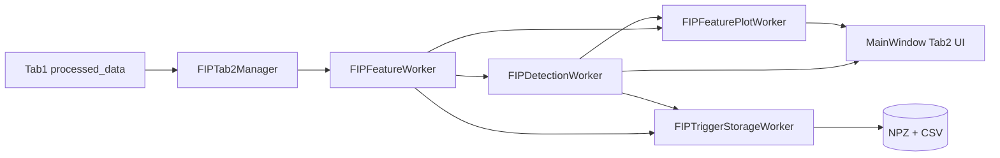
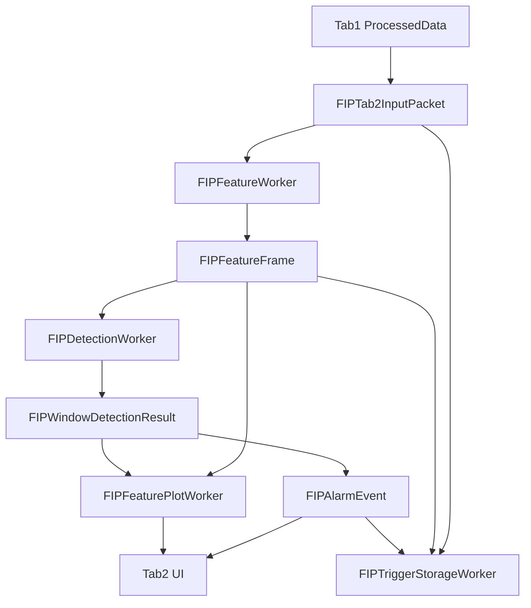

# 2026-03-12 Tab2 声发射信号短时特征提取与异常检测开发文档

## 1. 文档目的

本文档说明当前 `Tab2 / SigID` 的实现方案、目录结构和运行逻辑。内容已按当前代码重构结果更新，反映的是 `src/fip_tab2` 独立流水线，而不是早期的旧版 `features / detection / storage` 目录方案。

## 2. Tab2 功能目标

Tab2 当前用于对 Tab1 的下采样声发射信号做二次分析，包含：

- Tab2 自身的可选带通预处理
- 滑动窗口短时特征计算
- 基于滑动基线与阈值因子的异常检测
- 连续异常窗口聚合为告警事件
- 特征历史曲线显示
- 基线与阈值显示
- 告警表展示
- 触发前后数据片段保存

## 3. 当前代码结构

- `src/fip_tab2/__init__.py`
- `src/fip_tab2/fip_tab2_manager.py`
- `src/fip_tab2/fip_feature_worker.py`
- `src/fip_tab2/fip_detection_worker.py`
- `src/fip_tab2/fip_plot_worker.py`
- `src/fip_tab2/fip_trigger_storage.py`
- `src/fip_tab2/fip_types.py`

## 4. 总体架构

说明：

- Tab2 从 Tab1 取得的是 `ProcessedData.downsampled_data`
- `sample_rate` 来自 Tab1 的 `effective_rate`
- Tab2 拥有自己的预处理、特征提取、检测和存储逻辑
- Tab2 不直接依赖旧版 `features`、`detection`、`storage` 模块

## 5. 管理器：`fip_tab2_manager.py`

`FIPTab2Manager` 负责：

- 创建四个工作线程
- 连接线程间信号
- 将 Tab1 数据包装为 `FIPTab2InputPacket`
- 从 UI 读取参数并同步到各工作线程
- 启停、复位整个 Tab2 流水线

主要线程实例：

- `FIPFeatureWorker`
- `FIPDetectionWorker`
- `FIPFeaturePlotWorker`
- `FIPTriggerStorageWorker`

## 6. 特征提取：`fip_feature_worker.py`

### 6.1 输入

输入数据类型为 `FIPTab2InputPacket`：

- `timestamp`
- `comm_count`
- `sample_rate`
- `data`

其中 `data` 来自 Tab1 的 `downsampled_data`。

### 6.2 当前特征

当前已实现特征：

- `short_energy`
- `zero_crossing`
- `peak_factor`
- `rms`

默认启用计算的特征：

- `short_energy = True`
- 其余默认为 `False`

### 6.3 预处理

Tab2 在特征提取前可独立执行带通滤波，参数由 UI 控制：

- `enabled`
- `low_hz`
- `high_hz`
- `order`

这套预处理与 Tab1 的滤波设置相互独立。

### 6.4 滑动窗口

当前窗口参数由 UI 提供：

- `window_seconds`
- `overlap_ratio`

Worker 内部根据：

- `window_samples = round(window_seconds * sample_rate)`
- `hop_samples = round(window_samples * (1 - overlap_ratio))`

来驱动特征窗推进。

### 6.5 输出

输出数据类型为 `FIPFeatureFrame`，包含：

- `window_index`
- `start_time`
- `center_time`
- `end_time`
- `feature_values`
- `sample_rate`
- `window_size_seconds`
- `hop_seconds`

## 7. 异常检测：`fip_detection_worker.py`

### 7.1 检测思路

Tab2 当前采用按特征分别建基线、再做乘法阈值判定的方案。

对每个特征：

- 维护一个长度为 `100` 的滑动基线历史
- 对未触发窗口更新基线
- 使用 `threshold = baseline * factor`
- 若 `baseline` 过小，则退化为使用 `factor` 本身作为阈值下限

### 7.2 当前阈值参数

默认阈值因子：

- `short_energy = 3.0`
- `zero_crossing = 3.0`
- `peak_factor = 3.0`
- `rms = 3.0`

### 7.3 事件聚合

检测线程不会把每个异常窗口都当成一个告警事件，而是：

- 连续异常窗口先缓存到 `_active_window_results`
- 当后续窗口恢复正常时，再把这段连续异常聚合成一个 `FIPAlarmEvent`

事件内容包括：

- `event_id`
- `start_time`
- `end_time`
- `duration`
- `trigger_feature_names`
- `trigger_feature_count`
- `first_window_index`
- `last_window_index`
- `window_results`

### 7.4 输出信号

检测线程会发出：

- `window_detection_ready`
- `alarm_event_ready`
- `baselines_updated`
- `trigger_save_requested`

## 8. 特征显示：`fip_plot_worker.py`

`FIPFeaturePlotWorker` 负责维护特征历史曲线并输出给 UI。

当前特点：

- 每个特征单独维护一条时间序列
- 只保留最近 `display_duration_seconds` 范围内的数据
- 最多输出 4 路已启用绘图的特征
- 阈值线来自最近一次检测结果中的 `thresholds`

发送给 UI 的 payload 结构为：

- `times`
- `values`
- `threshold`

UI 侧通过 `MainWindow.update_feature_displays()` 更新各个 Tab2 图窗。

## 9. 触发存储：`fip_trigger_storage.py`

### 9.1 功能

当检测线程发出一个告警事件时，存储线程会在足够的后触发数据到达后，保存：

- 事件前后信号片段
- 对应时间轴
- 告警基本信息
- 参与触发时段内的特征曲线数据
- 逐窗口明细 CSV

### 9.2 当前缓存策略

存储线程会缓存：

- 过滤后的信号包
- 特征帧
- 待落盘请求

默认最大缓存历史：

- `30 s`

### 9.3 触发参数

默认值：

- `pre_trigger_seconds = 1.0`
- `post_trigger_seconds = 3.0`

这些参数可由 Tab2 UI 修改。

### 9.4 输出文件

NPZ 文件名格式：

- `an-YYYYMMDD-HHMMSS.mmm.npz`

同时在同一目录下维护：

- `alarm_details.csv`

CSV 中按窗口、按特征记录：

- 事件编号
- 对应 NPZ 文件名
- 事件起止时间
- 窗口序号
- 特征名
- 特征值
- 基线
- 阈值
- 是否触发

## 10. 当前 UI 能力

Tab2 当前界面位于 `src/ui/main_window.py`，提供以下能力：

### 10.1 特征选择

每个特征都支持两类勾选：

- `Compute`
- `Plot`

### 10.2 预处理设置

- 是否启用 Tab2 带通
- 低截止频率
- 高截止频率
- 滤波阶数

### 10.3 滑窗设置

- `window_seconds`
- `overlap_ratio`
- `display_duration_seconds`

### 10.4 阈值设置

- 每个特征单独的阈值因子
- 实时显示当前基线

### 10.5 触发存储设置

- 开关
- pre-trigger 秒数
- post-trigger 秒数
- 存储路径

### 10.6 显示输出

- 4 个特征图
- 1 个告警事件表
- 总告警数与当日告警数

## 11. 当前数据流

## 12. 与旧结构的区别

早期项目中，特征、检测、存储逻辑分别位于：

- `src/features`
- `src/detection`
- `src/storage`

现在这些旧模块已经不再参与当前运行链路。Tab2 已经改为以 `src/fip_tab2` 为中心的独立流水线，优点是：

- 目录更清晰
- 线程职责更集中
- 与 Tab1 的接口边界更明确
- 更适合后续继续扩展特征和检测策略

## 13. 当前结论

截至 2026-03-13，Tab2 已经完成从“初步功能实现”到“独立可运行流水线”的演进，当前具备：

- 独立特征提取线程
- 独立阈值检测线程
- 独立绘图缓存线程
- 独立触发存储线程
- GUI 参数同步能力
- 告警显示与触发存储闭环

当前 Tab2 已可作为软件中独立的异常识别模块继续迭代，后续主要工作将集中在：

- 特征体系扩展
- 阈值/基线策略优化
- 告警合并与抑制逻辑优化
- 数据回放与离线验证能力建设
