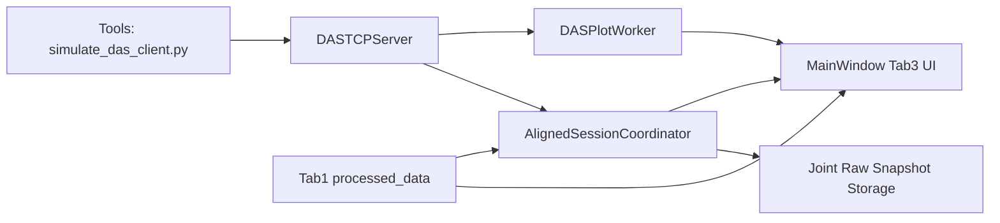
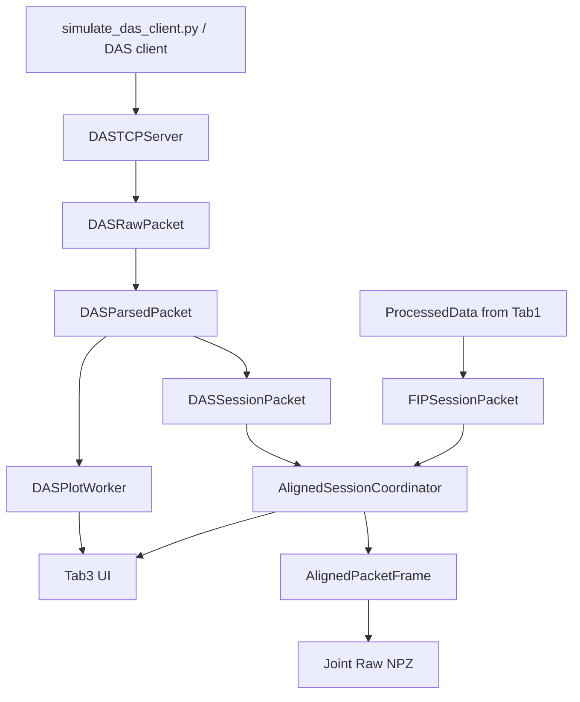

# 2026-03-14 Tab3 DAS 数据接收、对齐与绘图开发日志
## 1. 文档目的

本文档记录当前 `Tab3 / eDAS` 模块的开发结果、目录结构、运行链路、关键设计决策、验证方式和后续待办项。

本文档面向以下对象：

- 项目开发人员
- 后续联调人员
- 需要基于 `tab3` 继续开发 `tab4` 的实现人员

本文档描述的是当前代码状态，对应的实现以 `src/das_tab3`、`src/alignment`、`src/ui/main_window.py` 和 `src/main.py` 为准。

## 2. Tab3 功能范围

当前 `tab3` 已实现以下能力：

- DAS TCP 服务端独立启动与停止
- DAS 包头解析与数据体接收
- DAS 一维数据恢复为二维矩阵
- DAS 指定通道时域曲线显示
- FIP 对比曲线显示
- DAS `space-time` 图显示
- FIP 与 DAS 按 `comm_count` 的会话内对齐状态维护
- 缺失包区间记录
- DAS 10 秒无数据弹窗提醒
- 对齐后原始联合数据定时存储

当前 `tab3` 不负责以下能力：

- DAS 特征提取
- 位置-特征图
- 触发定位
- 触发分析结果导出

上述内容已转移到后续 `tab4` 的职责范围。

## 3. 当前代码结构

### 3.1 Tab3 专属目录

- `src/das_tab3/__init__.py`
- `src/das_tab3/das_types.py`
- `src/das_tab3/das_tcp_server.py`
- `src/das_tab3/das_plot_worker.py`
- `src/das_tab3/das_tab3_manager.py`

### 3.2 Tab3 共用对齐目录

- `src/alignment/__init__.py`
- `src/alignment/aligned_types.py`
- `src/alignment/aligned_session_coordinator.py`

### 3.3 Tab3 接入点

- `src/main.py`
- `src/ui/main_window.py`

### 3.4 Tab3 联调工具

本轮开发新增了独立联调工具目录：

- `tools/simulate_das_client.py`
- `tools/validate_tab3_pipeline.py`

说明：

- 上述工具不放入 `src/`，避免与正式运行链路混杂。
- 其中 `simulate_das_client.py` 用于模拟 DAS 客户端发包。
- `validate_tab3_pipeline.py` 用于 headless 自动验证收包与绘图数据生成。

## 4. 总体架构



说明：

- DAS 服务端与 FIP 服务端独立启动。
- `tab3` 使用独立的 DAS 接收链路，不复用 `tab1` 的 TCP 服务端。
- FIP 与 DAS 的对齐逻辑抽离到共享模块 `AlignedSessionCoordinator`。
- `tab3` 的联合原始存储建立在对齐层之上，不直接操作 UI 图形缓存。

## 5. 关键模块说明

### 5.1 `das_types.py`

该文件定义了 `tab3` 的基础数据结构：

- `DASPacketHeader`
- `DASRawPacket`
- `DASParsedPacket`

职责：

- 统一协议字段命名
- 统一 TCP 收包层与绘图层之间的数据接口
- 降低后续 `tab4` 复用时的耦合

### 5.2 `das_tcp_server.py`

`DASTCPServer` 负责：

- 监听 DAS TCP 端口，默认 `3678`
- 接收完整包
- 解析包头
- 校验 `data_bytes`
- 将数据体按大端 `float64` 解析为 `numpy.ndarray`
- 输出 `DASRawPacket`

当前包头协议如下：

1. `comm_count: uint32`
2. `sample_rate_hz: uint32`
3. `channel_count: uint32`
4. `data_bytes: uint32`
5. `packet_duration_seconds: float64`

关键实现点：

- 使用 `HEADER_STRUCT = struct.Struct(">IIIId")`
- 使用 `_recv_exact()` 保证完整接收指定字节数
- 使用 `np.frombuffer(payload, dtype=">f8")` 解析大端浮点数据
- 运行时持续向 UI 推送：
  - 连接状态
  - 包头摘要
  - 收包计数

### 5.3 `das_plot_worker.py`

`DASPlotWorker` 负责：

- 维护最近一段 DAS 历史包
- 提取指定通道时域曲线
- 生成 `space-time` 图所需矩阵
- 对显示数据执行轻量滤波和降采样

当前支持的显示参数：

- `das_channel`
- `display_seconds`
- `channel_start`
- `channel_end`
- `time_downsample`
- `space_downsample`
- `apply_filter`
- `low_hz`
- `high_hz`

当前输出 payload 包括：

- `das_curve_time`
- `das_curve_values`
- `space_time_matrix`
- `space_time_x`
- `space_time_y`
- `header`

### 5.4 `aligned_types.py`

该文件定义了会话对齐层的数据结构：

- `MissingRange`
- `FIPSessionPacket`
- `DASSessionPacket`
- `AlignedPacketFrame`
- `AlignmentStatusSnapshot`

这些结构的目的不是替代 `tab1/tab2` 的数据模型，而是为 `tab3/tab4` 提供统一的双源会话描述。

### 5.5 `aligned_session_coordinator.py`

`AlignedSessionCoordinator` 是当前 `tab3` 的核心共享层。

职责：

- 会话开始时重置状态
- 分别接收 FIP 与 DAS 包
- 按 `comm_count` 建立双源缓存
- 记录缺失包区间
- 输出对齐状态给 UI
- 为联合原始存储提供最近时间窗的对齐帧

当前状态分类：

- `waiting`
- `single-source`
- `aligned`
- `stopped`

当前缺失处理策略：

- 会话中跳号不终止流程
- 将缺失区间记录为 `MissingRange`
- 在 `tab3` 仅做状态显示和联合原始存储记录
- 真正的补零与触发时间窗处理放到后续 `tab4`

### 5.6 `das_tab3_manager.py`

`DASTab3Manager` 是 `tab3` 的管理器，负责串联整条 DAS 链路。

主要职责：

- 创建 `DASTCPServer`
- 创建 `DASPlotWorker`
- 接收 `tab1` 输出的 FIP `ProcessedData`
- 将 FIP 包转换为 `FIPSessionPacket`
- 将 DAS 包转换为 `DASSessionPacket`
- 将两侧数据送入 `AlignedSessionCoordinator`
- 负责 `tab3` 的联合原始存储定时器
- 负责 DAS 断连超时检测

## 6. 数据流说明



## 7. 协议与数据规格

### 7.1 DAS 包头

| 字段 | 类型 | 字节数 | 说明 |
|---|---|---:|---|
| `comm_count` | `uint32` | 4 | 会话内包序号，从 0 开始 |
| `sample_rate_hz` | `uint32` | 4 | 单通道采样率 |
| `channel_count` | `uint32` | 4 | 通道数量 |
| `data_bytes` | `uint32` | 4 | 数据体字节数 |
| `packet_duration_seconds` | `float64` | 8 | 单包时长 |

总包头长度：

- `24` 字节

### 7.2 DAS 数据体

数据体类型：

- 大端 `float64`

排列方式：

- 第 0 通道全部样本
- 第 1 通道全部样本
- ...
- 最后一个通道全部样本

当前恢复矩阵形状：

- `matrix.shape = (channel_count, samples_per_channel)`

其中：

- `samples_per_channel = round(sample_rate_hz * packet_duration_seconds)`

### 7.3 FIP 对齐输入

当前 `tab3` 使用来自 `tab1` 的以下字段参与对齐与显示：

- `ProcessedData.comm_count`
- `ProcessedData.unwrapped_data`
- `ProcessedData.downsampled_data`
- `ProcessedData.effective_rate`

FIP 在对齐层中当前固定按：

- `packet_duration_seconds = 0.2`

## 8. 当前 UI 能力

`tab3` 当前在 `MainWindow` 中已具备以下界面元素：

### 8.1 通信区

- DAS IP
- DAS 端口
- 连接状态
- 收包数量
- 最近 `comm_count`

### 8.2 包头状态区

- 通道数
- 采样率
- `data_bytes`
- 单包时长

### 8.3 对齐状态区

- FIP 最近 `comm_count`
- DAS 最近 `comm_count`
- 对齐状态
- FIP 缺失数
- DAS 缺失数
- 最近缺失区间

### 8.4 曲线控制区

- 曲线 1 类型：
  - `Off`
  - `DAS Channel`
  - `FIP`
- 曲线 2 类型：
  - `Off`
  - `DAS Channel`
  - `FIP`
- DAS 通道号
- 显示时长
- DAS 显示用带通滤波参数

### 8.5 `space-time` 参数区

- 起始通道
- 结束通道
- 时间降采样
- 空间降采样

### 8.6 原始联合存储区

- 开关
- 路径
- 单文件时间窗
- 缓存保留时长
- 最近一次输出文件

## 9. 联合原始存储说明

当前 `tab3` 的联合原始存储采取定时快照方式。

默认配置：

- 存储路径：`D:/PCCP/FIPeDASDATA`
- 单文件时长：`10.0 s`
- 缓存保留时长：`10.0 s`

当前保存字段：

- `comm_counts`
- `packet_start_times`
- `packet_duration_seconds`
- `fip_present`
- `das_present`
- `fip_raw_200khz`
- `fip_display_data`
- `das_raw_matrix`
- `missing_ranges`

说明：

- 当前存储格式以“工程联调可追踪”为优先目标。
- 后续若要支持更严格的离线复现，可继续规范字段命名和矩阵组织方式。

## 10. 通信异常与容错策略

当前 `tab3` 已落地的策略如下：

### 10.1 跳号/缺失

- 不终止当前会话
- 记录缺失区间
- UI 显示缺失状态
- 存储时保留缺失区间信息

### 10.2 断连

- 若 DAS 连接已建立，但连续 `10s` 未收到新包
- 弹窗提示用户
- 将 DAS 在线状态置为离线
- FIP 侧处理、显示和存储不受影响

### 10.3 会话重置

当前对 `comm_count == 0` 且会话已运行中的情况，协调器会记录警告日志。

说明：

- 当前版本尚未在 `tab3` 中进一步细分“设备端会话重置”的 UI 告警状态。
- 该部分建议在后续 `tab4` 和主状态机中继续完善。

## 11. 验证方式与结果

### 11.1 静态校验

本轮已对以下文件执行 `py_compile` 校验：

- `src/main.py`
- `src/ui/main_window.py`
- `src/alignment/*`
- `src/das_tab3/*`
- `tools/simulate_das_client.py`
- `tools/validate_tab3_pipeline.py`

结果：

- 通过

### 11.2 模块导入校验

已验证以下模块可正常导入：

- `main`
- `ui.main_window`
- `das_tab3`
- `alignment`

结果：

- 通过

### 11.3 Headless 联调验证

使用脚本：

- `tools/validate_tab3_pipeline.py`

验证内容：

- 启动 `DASTCPServer`
- 启动 `DASPlotWorker`
- 使用 `simulate_das_client.py` 内的发包逻辑发送模拟数据
- 检查是否收到至少 3 个包
- 检查是否生成至少 3 次绘图 payload

本地结果：

```text
VALIDATION_OK packets_received=3 plot_payloads=3 last_shape=(16, 800) last_curve_points=2400
```

说明：

- 当前已验证 `tab3` 的收包、解包、矩阵恢复和绘图数据生成链路可用。
- 该验证为 headless 验证，不等于完整 GUI 手工验收。

## 12. 与旧结构的区别

早期工程中：

- `tab3` 仅为占位页
- DAS 未建立独立目录
- 双源对齐逻辑尚未形成共享模块

本轮重构后：

- DAS 逻辑集中到 `src/das_tab3`
- 双源会话对齐逻辑集中到 `src/alignment`
- `main.py` 中新增独立 `tab3` 管理器
- UI 中新增 `tab3` 独立启停和状态面板
- 工具脚本放到 `tools/`，不与运行主代码混合

## 13. 当前局限与待办

当前仍存在以下限制：

- `tab3` 的 GUI 联调尚未进行人工可视化确认
- FIP 对比曲线当前使用 `tab1` 的处理后数据，尚未做更细粒度会话缓存封装
- `space-time` 图当前未加入色图、`vmin/vmax`、颜色栏控制
- 高通道数场景下尚未进行性能压测
- 断连后的更细粒度状态机仍可进一步补充

后续建议优先项：

1. 使用真实 GUI 运行 `tab3`，配合 `simulate_das_client.py` 做人工可视联调
2. 补 `space-time` 图的色图与动态范围控制
3. 规范联合原始存储文件格式
4. 在 `tab4` 中复用对齐层，完成补零触发窗处理、特征分析和定位

## 14. 当前结论

截至 2026-03-14，`tab3` 已从“未开发占位页”演进为“可独立启动的 DAS 接收、对齐、绘图与原始存储模块”，当前已经具备：

- 独立 DAS TCP 服务端
- 明确的 DAS 协议结构
- 独立绘图工作线程
- 独立双源对齐协调层
- 独立联调发送器与验证脚本
- 面向后续 `tab4` 复用的共享数据模型

因此，`tab3` 当前可以作为 `tab4` 定位分析开发的上游输入层继续迭代。
