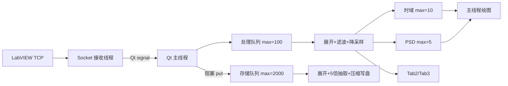
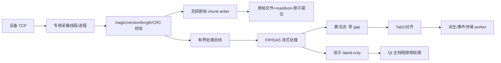

# 2026-06-10 当前版本软件 Bug 分析总结及其优化方案（GPT）

## 1. 范围与结论边界

本文基于 2026-06-10 工作区现行源码、README、开发文档和历史日志进行静态分析，重点检查 FIP Tab1 的 TCP 通信、线程、时域、PSD 和本地存储，并按 Tab 分析 Tab2、Tab3、Tab4。主要入口为 `src/main.py`、`src/fip_tab1/*`、`src/fip_tab2/*`、`src/das_tab3/*`、`src/alignment/*` 和 `src/ui/main_window.py`。

本次完成源码分析、日志抽查和全部 Python 文件语法编译检查；未接入真实 LabVIEW RT/eDAS 做持续 1000 kHz 压测。因此本文区分“代码可证实问题”和“高负载风险”，正式结论必须以第 9 节实机压测为准。

## 2. 直接结论

| 问题 | 结论 |
|---|---|
| 当前架构会不会丢数？ | **会。** Tab1 处理/绘图、Tab2、Tab3 绘图链路明确允许丢包；Tab1 存储在停止、关闭存储、磁盘慢、异常退出时也存在确定或高概率丢数路径。 |
| 1000 kHz 下同时开时域、PSD、存储会不会卡死？ | **存在明显卡死或长时间无响应风险。** 存储队列满后会在 Qt 主线程执行无超时阻塞式 `put()`；大数组、压缩、绘图和过密日志进一步增加 CPU、内存、磁盘与 GIL 压力。当前版本不能宣称稳定。 |
| 文件会不会丢部分数据包？ | **会。** 停止监测时存储线程不会先排空原始包队列；关闭存储时队列中已接收但未处理的包会被直接丢弃；异常退出无恢复机制。 |
| TCP 是否随机丢包？ | TCP 是可靠有序字节流，`_recv_exact()` 可处理拆包/粘包。主要风险是应用层消费不及时、主线程阻塞、协议失步、断连和进程退出。 |
| 当前存储是否为原始 1 MHz 数据？ | **不是。** 保存的是相位展开后按 `5` 抽取的 200 kHz `float64` 数据，不是 TCP 原始字节，也不是 1 MHz 原始样本。 |

## 3. Tab1 当前数据流与容量

假设原始采样率 $f_s=1{,}000{,}000\ \text{sample/s}$，每点 8 Byte，每包 $T_p=0.2\ \text{s}$：

$$N_p=f_sT_p=200{,}000\ \text{点}$$

$$B_p=N_p\times8=1{,}600{,}000\ \text{Byte}\approx1.6\ \text{MB}$$

$$R=f_s\times8\approx8\ \text{MB/s}$$

处理队列 100 包约持有 160 MB 原始数组；存储队列 2000 包约持有 3.2 GB、相当于 400 秒积压。Qt 跨线程事件队列没有显式上限，处理过程又会产生多份派生数组，因此峰值内存会更高。大队列会把吞吐不足转化为 GB 级内存增长、换页和卡死，并不等于安全。

## 4. Tab1 / FIP 问题

### P0-1：存储队列满会阻塞 Qt 主线程

**证据：** `src/main.py:339-375` 在主线程接收 TCP 信号并调用 `process_raw_packet()`；`src/fip_tab1/fip_tab1_manager.py:892-900` 分发到存储；`499-516` 执行无超时的 `input_queue.put(packet, block=True)`。

磁盘或压缩吞吐不足时，主线程会无限等待，UI、绘图、统计和启停全部停顿。TCP 线程短时间仍可收包并发信号，之后事件队列和 TCP 缓冲继续积压，设备端可能因流控、缓存上限或超时而断连/丢源数据。这是 1000 kHz 全功能运行最危险的卡死路径。

**方案：** TCP 完整包直接进入专用采集线程/进程的有界缓冲或原始 spool，不经过 Qt 主线程；禁止 UI 路径阻塞。队列满时必须明确选择发送端流控、可靠 spool 或记录丢弃范围并报警。

### P0-2：停止监测时未排空存储队列，尾部确定丢失

`DataStorageThread.run()` 在 `running=False` 后立即结束，只刷新已进入 `buffered_requests` 的数据；仍在 `input_queue` 的原始包不再处理。管理器只等待线程 3 秒后继续结束 run cycle。

**方案：** 两阶段停止：先停上游并记录最后接收序号，再发送 `STOP_AFTER_DRAIN`；存储线程排空到该序号、原子提交并返回确认后，UI 才显示停止。超时必须显示“未完整落盘”。

### P0-3：运行中关闭存储会丢队列数据并引入并发竞争

`set_enabled(False)` 从 UI 线程直接刷新和清空缓冲；存储线程随后取到的队列包因 `enabled=False` 直接 `continue`。UI 与存储线程还可能同时修改缓冲和写文件。

**方案：** 所有启停、路径、分块时长变更都作为控制消息交给存储线程串行执行；关闭提供“排空后关闭”和“立即关闭并记录丢弃”模式。

### P0-4：非法协议头会导致 TCP 字节流失步

`src/fip_tab1/fip_tcp_server.py:183-197` 遇到非法 `data_length` 直接 `continue`，没有关闭连接、丢弃包体或重新同步。一次坏头后，后续包体可能持续被误认为头部。DAS TCP 有类似问题。

**方案：** 协议增加 `magic/version/header_length/payload_length/raw_comm_count/CRC32`；非法长度或 CRC 失败立即关闭本会话并重连。

### P0-5：没有端到端完整性账本，无法证明“收到的都存了”

当前无法审计 Qt 事件积压、存储队列尾包、磁盘满、压缩失败、异常退出和文件损坏；原始 `raw_comm_count` 未进入最终 `RawDataPacket`/文件；文件只有首尾计数且可能跨包切片。

**方案：** 建立 append-only manifest，记录 `session_id`、原始/规范化序号、接收时间、样本数、CRC、文件、偏移、写入状态和丢弃原因。只有账本闭环才能声明无损。

### P1-1：处理和绘图链路主动丢包且统计不足

`DataProcessingThread` 满时丢最旧包；时域队列满时丢当前包；PSD 满时静默不入队。Tab2 和 Tab3 接收到的也是处理队列幸存包。

**方案：** 无损采集流与可丢帧显示流彻底分离。显示采用 latest-only mailbox；所有路径统一统计 `received/enqueued/processed/dropped/failed/depth/oldest_age_ms`。

### P1-2：缺包后相位展开仍沿用上一包状态

`PhaseUnwrapper` 用 `_last_phase` 保持跨包连续，但发现序号缺口时不重置，可能将缺口两侧错误地用 $2\pi$ 偏移强行连续。

**方案：** `comm_count != last+1` 时重置展开/滤波状态或写入 gap marker；跨缺口数据不得标为连续有效。

### P1-3：存储降采样无抗混叠滤波

存储固定执行 `unwrapped[::5]`。100 kHz 以上成分会混叠到保存频带。若目标是分析用 200 kHz 数据，必须先有状态低通再抽取；若目标是保真，应保存 1 MHz 原始定点字节，处理结果另存。

### P1-4：实时链路日志过密

TCP 解析和主线程对几乎每包输出多条 INFO。历史 `pccp_monitor.log` 已超过 18 MB。日志格式化、锁、文件和控制台写入会制造抖动。

**方案：** 正常状态每 5 至 10 秒聚合一次；异常/缺口即时记录；启用滚动日志和容量上限。

### P1-5：运行时参数更新存在状态竞争

滤波器和降采样器由处理线程使用，但 UI 可从主线程直接改系数、状态和 factor。应通过 worker 控制队列在包边界原子切换，并给输出记录配置版本。

### P1-6：计数归一化隐藏原始序号和会话异常

任意原始计数回退都会重新归零，且最终存储不保留原始计数。应由接收端生成唯一 `session_id`，保留原始序号；规范化计数只用于 UI。

### P1-7：线程停止超时后仍继续操作共享状态

线程最多等待 3 秒；若仍在压缩/处理，主线程会继续清图和结束周期，之后可能重启未结束线程。应实现 `STOPPED/STARTING/RUNNING/DRAINING/ERROR` 状态机，未确认停止时禁止重启。

## 5. Tab2 / FIP SigID 问题

### P1-8：多级队列满则丢最旧，但丢失静默隐藏

特征、检测、绘图、触发存储队列均采用该策略。显示可以丢帧，异常检测和触发存储不应静默丢失。

### P1-9：丢包后时间轴仍连续，可能产生错误窗口和报警

`FIPFeatureWorker` 按收到的样本数构造时间轴，不检查 `comm_count` 缺口。丢包两侧数据会被拼入同一滑窗，事件时间整体提前。

**方案：** 输入携带 `session_id/raw_comm_count/first_sample_index`；发现缺口时清空滑窗或插入无效区间，事件附带 `data_quality`，禁止跨 gap 计算。

### P1-10：停止时可能丢待处理特征和待保存事件

Tab2 立即停止各 worker，不先排空队列；pending request 可能未达到 post-trigger 或未写盘。应 drain + ack；未完成事件保存为 `truncated` 并标明缺失。

### P2-1：算法缺少数据质量和可复现信息

基线没有明确预热状态、缺口后重建、饱和/静默检测和阈值版本。现场误报/漏报难以复现。

## 6. Tab3 / eDAS 问题

### P0-6：联合存储在 Qt 主线程直接压缩写盘

`DASTab3Manager._maybe_store_snapshot()` 由主线程 `QTimer` 每秒调用，并直接构造大对象数组和执行 `np.savez_compressed()`。DAS 多通道矩阵较大时会冻结整个软件。

**方案：** 移到独立存储进程/线程；主线程只提交不可变描述符；连续大数据优先使用 HDF5/Zarr/固定头二进制 chunk。

### P1-11：每秒保存最近 interval 秒，产生大量重叠文件

timer 固定 1 秒，`interval_seconds` 只决定回看窗口。interval 为 10 秒时相邻文件约 90% 重复，造成写放大和 CPU 浪费。应保存不重叠的 `[last_saved, current)` chunk。

### P1-12：“aligned”只代表两路在线，不代表真实对齐

两路 online 即返回 `aligned`，未验证序号相等、时间差、包时长或时钟同步。FIP 是每连接归一化计数，DAS 是原始计数，未必同域。

**方案：** 使用共同硬件触发序号或 PTP/GPS 时间戳；状态区分 `online/aligning/aligned/drift/gap`，展示 $\Delta t$ 和漂移率。

### P1-13：联合存储字段名与实际数据不一致

`fip_raw_200khz` 实际写入 `ProcessedData.unwrapped_data`，通常是 1 MHz 数据；会误导后续采样率解释。

### P1-14：DAS 每包重复拼接并过滤整个历史

窗口越长计算越重，容易造成绘图队列丢帧。应使用固定环形数组、流式 `sosfilt` 和增量瀑布图，只绘制屏幕所需点数。

### P1-15：DAS 协议无合理最大长度、CRC 和会话信息

错误头可触发超大读取等待，坏头也可能使流失步。应与 FIP 协议一并加固。

### P2-2：缺失统计口径不准确

当前 missing count 统计缺失区间数，不是缺失包数，例如缺失 `100-199` 只计 1。应同时展示区间数和包数。

## 7. Tab4 与文档问题

Tab4 当前仅为占位页，尚无定位算法、线程、存储和验收实现。上线版本应禁用或明确标注未实现。

编码与维护问题：

- `docs/2026-03-20-Tab1-干涉仪数据存储技术说明.md` 已含大量被替换成问号字符的内容，中文实际损坏；
- `src/main.py` 和 `src/fip_tab1/fip_tab1_manager.py` 有被替换成问号字符的损坏 docstring；
- 4 个 Tab2 源文件带 UTF-8 BOM；
- 部分“稳定”“不丢包”表述缺少持续压测证据；
- 缺少无损存储、启停尾包、慢盘、磁盘满、断网、计数复位和坏包自动测试。

## 8. 推荐架构与整改顺序

原则：采集无损流与显示流分离；Qt 主线程只做 UI；背压必须显式；原始数据先可靠落盘、处理数据可重算；所有输出带会话、原始序号、样本索引、配置版本和数据质量。

**第一阶段，消除 P0：**

1. 移除主线程阻塞入队，实现 Tab1 存储 drain/ack。
2. Tab3 压缩存储移出主线程并改为不重叠 chunk。
3. 协议增加 magic/version/CRC/session，保留原始序号。
4. 建立 manifest 和统一队列/完整性统计。

**第二阶段，修复算法与性能：**

1. 缺包时重置状态或插入 gap，Tab2 禁止跨 gap 计算。
2. 存储降采样增加抗混叠，或保留 1 MHz 原始数据。
3. 时域、PSD、DAS 使用 latest-only 显示队列，UI 限制 10 至 20 FPS，绘图点数限制到像素量级。
4. DAS 改为环形缓冲和增量处理；参数更新在包边界应用。

**第三阶段，补齐工程化：** 仿真器、故障注入、CRC 自动核对、乱码修复、滚动日志、Tab4 独立验收。

## 9. 1000 kHz 必做压测与验收

| 场景 | 时长 | 必须满足 |
|---|---:|---|
| 仅接收 + 原始存储 | 24 h | 原始序号缺失 0；发送/接收/落盘 CRC 一致；内存稳定 |
| 时域 + PSD + 存储 | 24 h | UI 可交互；无主线程停顿超过 200 ms；原始存储缺失 0 |
| Tab1 + Tab2 + Tab3 | 8 h | 算法流缺口为 0 或全部显式标记；队列深度稳定 |
| 慢盘，写入低于 8 MB/s | 30 min | 触发流控/spool/报警；不得静默丢包或无限冻结 |
| 磁盘满 | 10 min | 明确告警并停止/流控；已提交文件不损坏 |
| 队列积压时点击停止 | 100 次 | 排空到最后接收序号，或明确报告未完整落盘 |
| 断网/重连/计数复位 | 100 次 | session 可识别；原始序号保留；缺口准确 |
| 坏头/坏长度/坏 CRC | 1000 包 | 不失步；按策略重连；坏包可审计 |

建议硬指标：24 小时原始包缺失数 $=0$；每个 chunk 样本数/序号/CRC 全匹配；P99 UI 延迟 $<100\ \text{ms}$、最大 $<500\ \text{ms}$；稳态队列不持续增长；预热后 8 小时 RSS 增长小于约 10%；停止确认前最后接收序号等于最后持久化序号。

## 10. 最终判断

当前版本已形成 FIP 收包、处理、显示、Tab2 检测、Tab3 DAS 接收和存储的基本闭环，但仍属于“可联调、需继续工程化”的版本，不能从代码和现有日志证明其满足 1000 kHz、全功能同时开启、长期连续运行时的无损与流畅性要求。

最关键的判断：显示链路丢帧是当前允许行为；存储链路虽用大队列和阻塞入队试图保数据，但阻塞点在 Qt 主线程，且停止/关闭不排空队列，因此仍会卡顿并可能丢数；当前没有端到端完整性账本，即使现场看起来正常，也无法严格证明文件完整。在完成 P0 改造和 24 小时全功能压测前，不建议将当前版本定义为可无损连续采集的正式版本。
