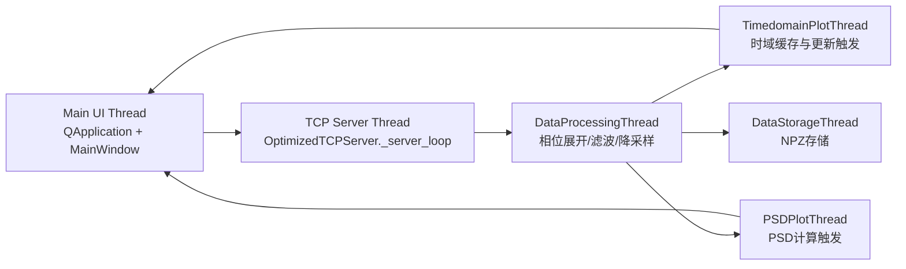
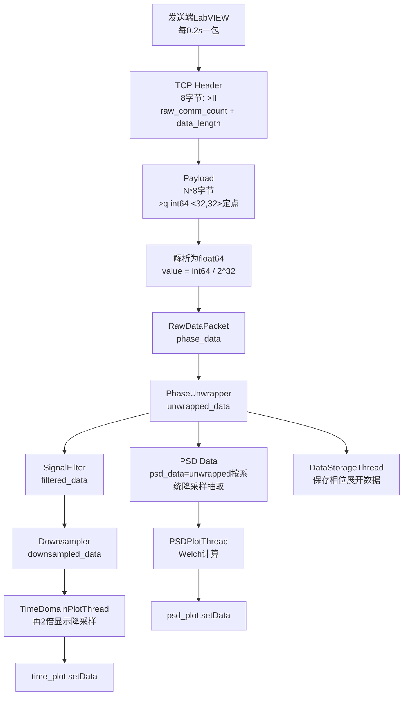

# 2026-3-12 Tab1 声发射数据通信与绘图功能开发总结

## 1. Tab1 整体设计概览

Tab1 面向干涉仪声发射传感器的实时数据链路，覆盖以下能力：
- TCP/IP 通信接收与解包
- 原始定点数到浮点数转换
- 预处理：相位展开、滤波、降采样
- 时域波形绘图（实时更新）
- PSD 频谱计算与绘图（周期更新）
- 相位展开数据存储（可开关）

当前实现采用“主线程 + 专用工作线程”的架构，保证 UI 响应与实时处理并行。

### 1.1 关键代码文件

- `src/main.py`：应用主控、组件初始化、信号连接、启动/停止流程
- `src/comm/tcp_server_optimized.py`：TCP 服务端、收包解包、通信计数归一化
- `src/processing/tab1_optimized_threads.py`：Tab1 核心线程系统（处理/时域/PSD/存储）
- `src/processing/phase_unwrap.py`：相位展开算法
- `src/processing/signal_filter.py`：数字滤波器设计与执行
- `src/processing/downsampling.py`：降采样实现
- `src/visualization/wave_plotter.py`：`PSDCalculator`（Welch 方法）
- `src/ui/main_window.py`：Tab1 控件与绘图开关信号

---

## 1.2 线程架构

说明：
- UI 主线程负责控件状态与曲线对象更新（`setData`）。
- CPU 密集型处理放在后台线程，避免主线程卡顿。
- 线程间通过 `Queue` + `pyqtSignal` 传递数据。

---

## 1.3 数据流与节点参数（采样率/数据量/类型）

### 1.3.1 端到端流程图

### 1.3.2 节点数据规格表（默认 downsample=5）

| 节点 | 位置/文件 | 采样率 | 每包样本数 | 数据类型 | 备注 |
|---|---|---:|---:|---|---|
| TCP 原始 payload | `tcp_server_optimized.py` | 1 MHz 原始等效 | 200000 | big-endian int64（<32,32>） | `data_length=1600000` 字节 |
| 解析后相位 | `tcp_server_optimized.py` | 1 MHz | 200000 | `np.float64` | `int64 / 2^32` |
| 相位展开输出 | `DataProcessingThread` | 1 MHz | 200000 | `np.float64` | `unwrapped_data` |
| 滤波输出 | `DataProcessingThread` | 1 MHz | 200000 | `np.float64` | `filtered_data` |
| 系统降采样输出 | `DataProcessingThread` | 200 kHz | 40000 | `np.float64` | `downsampled_data`，默认 5 倍 |
| 时域显示输入 | `TimedomainPlotThread` | 100 kHz | 20000 | `np.float64` | 对 `downsampled_data` 再 `::2` |
| PSD 输入 | `PSDPlotThread` | 200 kHz | 40000 | `np.float64` | 使用 `psd_data`（未滤波） |
| 存储数据 | `DataStorageThread` | 1 MHz逻辑相位 | 200000 | `np.float64` | 保存 `unwrapped_data` 到 `.npz` |

---

## 2. TCP/IP 通信细节

## 2.1 实现方式

- 库/类/函数：
  - `socket`：`socket.socket`、`accept`、`recv`
  - `struct`：`struct.unpack('>II')`、`struct.unpack(f'>{point_count}q')`
  - 线程：`threading.Thread`（通信循环）
- 主类：`OptimizedTCPServer`（`src/comm/tcp_server_optimized.py`）

## 2.2 数据包格式

- Header：8 字节，`>II`
  - `raw_comm_count`：4 字节无符号整型
  - `data_length`：4 字节无符号整型
- Body：`data_length` 字节
  - 每点 8 字节，`>q`（big-endian int64）
  - 语义为 `<32,32>` 定点数
- 转换：
  - `float_value = int64_value / 2^32`

## 2.3 通信计数处理（会话从 0 开始）

- 新连接建立后，自动重置计数归一化基准：
  - `_comm_base_raw = None`
  - 第一包归一化后 `comm_count=0`
- 若发送端计数中途回退（重连/复位），自动 re-base，重新从 0 起算。
- 包对象同时保留：
  - `comm_count`：会话内归一化计数
  - `raw_comm_count`：原始计数（用于排障）

## 2.4 丢包与卡顿优化策略

- 增大接收缓冲区：`SO_RCVBUF = 8MB`
- 低时延参数：`TCP_NODELAY = 1`
- 精确接收：`_recv_exact(size)` 循环收齐，避免半包解析
- 包长度校验：拒绝 `0` 或异常大 `data_length`
- 性能监控：周期输出接收耗时、吞吐率、队列指标
- 线程解耦：通信与处理分离，避免 UI/处理阻塞影响接收

---

## 3. 时域绘图细节

## 3.1 编程方案

- 绘图库：`pyqtgraph`
- 关键对象：
  - `PlotWidget`
  - `PlotDataItem`（曲线对象）
- 线程：`TimedomainPlotThread` 负责时域数据缓存与触发更新
- UI 更新方式：`OptimizedTab1ThreadManager._update_time_plot()` 调用 `time_curve.setData(times, values)` 覆盖更新

## 3.2 更新策略

- 输入：`downsampled_data`（系统降采样后）
- 显示前再降采样：`display_data = downsampled_data[::2]`
- 默认每 5 包更新一次时域（约 1 秒一次）
- 维护滑动窗口（默认 1 秒）

## 3.3 卡顿/丢数/重叠问题与解决

- 防卡顿：
  - 时域线程输入队列有上限，满时丢弃新/旧策略避免阻塞主链路
  - 降低刷新频率（每 5 包）减少 UI 压力
- 防曲线叠加：
  - 仅维护单条 `PlotDataItem`
  - 更新使用 `setData` 覆盖，不重复 `plot()`
- 防波形重叠/时间轴异常：
  - 使用内部单调时间轴 `next_timestamp`
  - 显示采样率按 `effective_rate` 动态计算，不写死
- 防通信重连导致“时域不显示”：
  - 对 `comm_count` 回退做重置判定（如 139→0），自动清空时域流状态并恢复

---

## 4. PSD 计算与绘图策略

## 4.1 计算方式

- 库/函数：
  - `scipy.signal.welch`
- 封装类：`PSDCalculator`（`src/visualization/wave_plotter.py`）
- 输入数据：
  - `psd_data`（相位展开后、未滤波）
  - 满足“PSD 不经过滤波器”的设计要求

## 4.2 关键参数（当前实现）

- `window='hann'`
- `overlap=0.5`（`noverlap = int(nperseg * 0.5)`）
- `detrend='linear'`
- `scaling='density'`
- `return_onesided=True`
- `nperseg`规则：
  - 若未指定：`min(len(data)//8, sample_rate, 50000)`
  - 最终限制：`max(256, min(nperseg, len(data)//2, 50000))`

## 4.3 更新频率与绘图

- `PSDPlotThread` 默认每 5 包计算一次（约 1 秒）
- 每次计算前将 `psd_calculator.sample_rate` 同步到 `data.effective_rate`
- 功率谱转 dB：
  - `psd_safe = max(psd, 1e-15)`
  - `psd_db = 10*log10(psd_safe)`
  - 显示截断：`[-200, 100] dB`
- UI 更新：`psd_curve.setData(frequencies, psd_db)`

---

## 5. 存储策略（Tab1）

- 线程：`DataStorageThread`
- 存储对象：相位展开数据 `unwrapped_data`
- 格式：`np.savez_compressed`
- 默认节流：每 10 包存一次（可通过开关启停）
- 文件命名：`phase_data_YYYYMMDD_HHMMSS_mmm_#xxxxxx.npz`

---

## 6. 当前 Tab1 设计结论

Tab1 已形成稳定的“通信-处理-绘图-存储”闭环：
- 通信层支持会话计数归一化与高吞吐优化
- 处理链路明确区分时域与 PSD 数据源
- 时域和 PSD 都采用线程化与覆盖式更新，兼顾实时性与 UI 稳定性
- 已针对实际问题（丢包、卡顿、曲线叠加、计数回退）落实了工程化修复策略

该设计可作为后续 Tab2/全系统扩展时的标准基线。