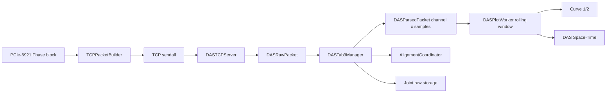

# 2026-6-19 wb-monitor tab3 绘图功能更新日志

## 1. 更新目标

本次更新面向 `wb-monitor` Tab3 的 eDAS 接收绘图链路，目标是使服务端接收到 `pcie6921_gui` 发送的 Phase 数据后，呈现方式尽量接近客户端已有图形：

- Tab3 图 3 `DAS Space-Time` 对齐 `pcie6921_gui` Tab2 `Time-Space Plot` 的矩阵方向、滚动窗口、颜色映射和色阶控制逻辑。
- Tab3 图 1/图 2 在选择 `DAS Channel` 时，对齐 `pcie6921_gui` Tab1 `Space` 模式下单空间点随时间变化的时域曲线效果。

## 2. 数据流更新

更新后的数据流为：

服务端现在以载荷字节数恢复矩阵：

$$
N=\frac{data\_bytes}{8\times channel\_count}
$$

$$
M=reshape(payload, (channel\_count, N))
$$

其中 $M$ 的第 0 维为空间通道，第 1 维为时间采样点。

## 3. Space-Time 图更新

旧版本每次只把最新一个包的矩阵显示到图 3，因此图像缺少连续滚动窗口效果。新版本在 `DASPlotWorker` 内保留最近 `display_seconds` 秒的数据包，并按时间方向拼接：

$$
M_{window}=[M_{k-r},M_{k-r+1},\ldots,M_k]
$$

通道和时间降采样为：

$$
M_{plot}=M_{window}[channel\_start:channel\_end+1:space\_downsample, ::time\_downsample]
$$

图像坐标采用：

$$
\Delta t=\frac{time\_downsample}{sample\_rate\_hz}
$$

$$
x=[0,1,2,\ldots,N_{plot}-1]\Delta t
$$

纵轴为实际通道号序列：

$$
y=[channel\_start, channel\_start+space\_downsample, \ldots]
$$

UI 层继续使用 `ImageItem + HistogramLUTWidget`，并补充颜色条分布范围更新，使 `vmin/vmax` 保持用户设定的显示色阶，同时颜色条仍覆盖当前数据分布。

## 4. DAS Channel 曲线更新

Tab3 图 1/图 2 的 `DAS Channel` 曲线从滚动历史中提取指定通道：

$$
s(t)=M[channel, :]
$$

若开启带通滤波，使用前面板设置的 `low_hz` 和 `high_hz` 对窗口内曲线做显示用滤波；原始接收矩阵和存储数据不受滤波影响。曲线显示增加最大点数控制，默认最多显示 `100000` 点，超过时只做显示抽取，避免 pyqtgraph 长曲线造成 UI 卡顿。

## 5. 通信连续性显示

Tab3 通信面板新增 `Missing` 计数。服务端按 `comm_count` 判断是否存在缺口：

$$
missing=comm\_count_k-comm\_count_{k-1}-1
$$

当 $missing>0$ 时累计到 `missing_packets`，同时写入日志。正常联调时该值应保持 `0`。

## 6. 修改文件

`wb-monitor` 侧：

- `src/das_tab3/das_tcp_server.py`：服务端按 payload 字节数恢复样本数，增加缺口统计和 socket 缓冲区设置。
- `src/das_tab3/das_tab3_manager.py`：矩阵恢复改为按实际载荷长度计算，输出连续内存矩阵。
- `src/das_tab3/das_plot_worker.py`：构建滚动 Space-Time 矩阵，曲线增加显示密度控制。
- `src/ui/main_window.py`：新增 Missing 统计显示，优化曲线 fast-path 和颜色条范围更新。

`pcie6921_gui` 侧：

- `src/tcp_tab3/tcp_sender_worker.py`：发送队列可靠化，不再因队列阈值或暂未连接而丢弃数据块。
- `src/tcp_tab3/tcp_tab3_manager.py`：默认队列告警阈值调整为 `128`。
- `src/main_window.py`：Tab3 通信设置同步使用 `queue_max_packets=128`。

## 7. 验收建议

1. 先启动 `wb-monitor` Tab3 服务端，再启动 `pcie6921_gui` 采集和 Tab3 通信。
2. 检查发送端 `Sent` 与接收端 `Packets` 是否同步增长。
3. 检查接收端 `Missing` 是否保持 `0`。
4. 在 `pcie6921_gui` Tab2 和 `wb-monitor` Tab3 图 3 设置相同的通道范围、`Time Downsample`、`Space Downsample`、`Colormap`、`vmin/vmax`，观察 Space-Time 图是否方向一致、颜色变化一致。
5. 在 `pcie6921_gui` Tab1 选择 `Space` 模式，并在 `wb-monitor` Tab3 图 1 或图 2 选择同一 `DAS Channel`，检查时域曲线趋势是否一致。
