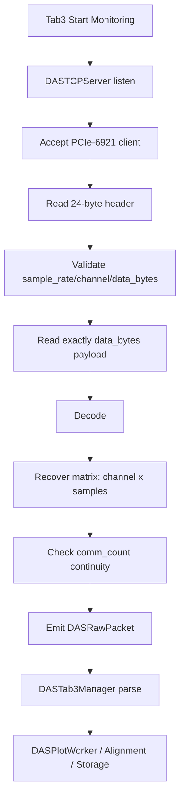

# 2026-6-19 通信协议与数据包格式

## 1. 文档目的

本文档记录 `PCIe-6921/pcie6921_gui` 与 `wb-monitor` 之间的 eDAS Phase 数据通信协议、数据包格式、矩阵恢复规则和可靠性约束。两套软件属于同一系统的不同模块：

- `pcie6921_gui`：客户端，负责采集 PCIe-6921 Phase 数据、截取通道范围、执行显示一致的单位换算，并通过 TCP 发送。
- `wb-monitor`：服务端，负责接收数据包、解析包头、恢复 $channel \times time$ 矩阵，并进入 Tab3 绘图、对齐和存储链路。

## 2. 传输角色与连接参数

| 项目 | 角色 | 默认地址/端口 | 说明 |
|---|---:|---:|---|
| `pcie6921_gui` | TCP Client | 用户配置的 Server IP，默认端口 `3678` | 采集开始后按完整 Phase 块入队发送 |
| `wb-monitor` | TCP Server | `0.0.0.0:3678` | Tab3 点击开始监测后监听客户端连接 |

通信使用 TCP 长连接。两端均启用 `TCP_NODELAY`，并扩大 socket 缓冲区，避免小包延迟和瞬时吞吐抖动导致发送端积压。

## 3. 数据包总体结构

每个包由固定长度包头和连续载荷组成：

```text
+----------------------+-------------------------------+
| Header: >IIIId       | Payload: little-endian int32   |
| 24 bytes             | data_bytes bytes              |
+----------------------+-------------------------------+
```

包头使用 Python `struct.Struct(">IIIId")`，即大端序：

| 字段 | 类型 | 字节数 | 含义 |
|---|---:|---:|---|
| `comm_count` | `uint32` | 4 | 通信包序号，从每次采集会话开始递增 |
| `sample_rate_hz` | `uint32` | 4 | 发送载荷的每通道时间采样率 |
| `channel_count` | `uint32` | 4 | 发送载荷中的空间通道数 |
| `data_bytes` | `uint32` | 4 | 载荷字节数 |
| `packet_duration_seconds` | `float64` | 8 | 本包对应的时间长度 |

载荷为小端 `int32`（x86 本机字节序），按 C-order 行优先展开，恢复后矩阵形状为：

$$
M \in \mathbb{R}^{C \times N}
$$

其中 $C=channel\_count$，$N=data\_bytes/(4C)$。服务端以 `data_bytes` 和 `channel_count` 为准恢复 $N$，不再仅依赖浮点时长反推点数，避免浮点舍入导致误判有效包。恢复后在服务端统一按 `phase_rad = phase_int32 / 32767 * pi` 换算为弧度。

## 4. 客户端矩阵构建规则

`pcie6921_gui` 从采集线程得到一块 Phase 数据后，按采集上下文先恢复为时间优先矩阵：

$$
A \in \mathbb{R}^{F \times P}
$$

其中 $F=frame\_load\_num$，$P=point\_num\_after\_merge$。载荷为原始 `int32` 相位计数，客户端不再做弧度换算，改为由服务端接收后统一换算：

$$
phase_{rad}=\frac{phase_{int32}}{32767}\pi
$$

通道截取和降采样流程为：

$$
A_s = A[:, channel\_start:channel\_end+1:space\_downsample]
$$

随后转置为服务端约定的空间优先矩阵：

$$
M = A_s^T[:, ::time\_downsample]
$$

发送采样率和包时长分别为：

$$
f_s' = \frac{f_s}{time\_downsample}
$$

$$
T = \frac{N}{f_s'}
$$

其中 $N$ 是每个通道发送的样本数。

## 5. 可靠性策略

本次更新后通信链路采用“可靠优先”的策略：

1. 客户端队列不再因为达到阈值而丢弃旧包；阈值仅作为积压告警。
2. 服务端尚未启动或网络短时不可用时，客户端保留队首数据块，重连成功后继续发送。
3. 客户端仅在完整 `sendall(header + payload)` 成功后移除队首数据，并递增 `comm_count`。
4. 服务端记录 `comm_count` 缺口并显示 `missing_packets`，用于现场确认链路是否真实连续。
5. 构包失败属于本地数据尺寸或参数错误，仍计入 `dropped_packets`，因为该数据块无法形成合法协议包。

需要注意：若网络吞吐长期低于采集数据产生速率，任何软件都无法同时保证无限期“零积压”和“零丢包”。当前实现选择不主动丢弃应用层数据，并通过队列积压告警提示用户降低通道数、提高降采样或检查链路。

## 6. 服务端解析流程



## 7. 联调检查项

- `pcie6921_gui` Tab3 `Sent` 应连续增长，`Dropped` 仅在参数非法时增长。
- `wb-monitor` Tab3 `Packets` 应与发送端 `Sent` 同步增长。
- `wb-monitor` Tab3 `Missing` 应保持 `0`；若增长，检查发送端日志中的队列积压和网络状态。
- `channel_count`、`sample_rate_hz`、`data_bytes`、`packet_duration_seconds` 应与发送端状态栏一致。
- Space-Time 图横轴时间长度应满足 $T_{window}\approx packets\_in\_window \times packet\_duration\_seconds$。
